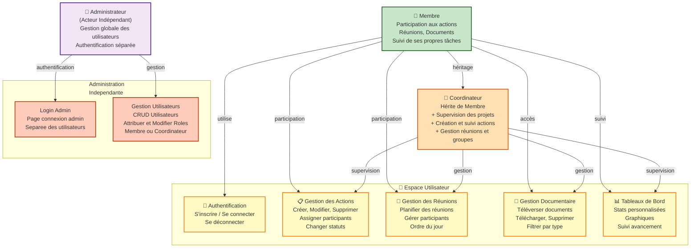

# Diagramme de Cas d'Utilisation - Portail de Gestion Multi-Acteurs

## Diagramme Mermaid (Complet)

```mermaid
graph TB
    %% Acteurs
    Membre[👤 Membre]
    Coordinateur[👤 Coordinateur]
    Administrateur[👤 Administrateur]

    %% Cas d'utilisation - Authentification
    subgraph Auth["🔐 Authentification"]
        UC1[S'inscrire]
        UC2[Se connecter]
        UC3[Se déconnecter]
    end

    %% Cas d'utilisation - Gestion des Actions
    subgraph Actions["📋 Gestion des Actions"]
        UC4[Consulter actions assignées]
        UC5[Créer une action]
        UC6[Modifier une action]
        UC7[Supprimer une action]
        UC8[Changer statut action]
        UC9[Filtrer actions par statut/priorité]
        UC10[Assigner participants à action]
    end

    %% Cas d'utilisation - Gestion des Réunions
    subgraph Reunions["📅 Gestion des Réunions"]
        UC11[Consulter réunions]
        UC12[Créer une réunion]
        UC13[Modifier une réunion]
        UC14[Supprimer une réunion]
        UC15[Ajouter participants réunion]
        UC16[Consulter détails réunion]
    end

    %% Cas d'utilisation - Gestion Documentaire
    subgraph Documents["📄 Gestion Documentaire"]
        UC17[Consulter documents]
        UC18[Téléverser document]
        UC19[Télécharger document]
        UC20[Supprimer document]
        UC21[Filtrer documents par type]
    end

    %% Cas d'utilisation - Tableaux de Bord
    subgraph Dashboard["📊 Tableaux de Bord"]
        UC22[Voir tableau de bord personnalisé]
        UC23[Consulter statistiques globales]
        UC24[Voir graphiques répartition actions]
        UC25[Voir statistiques par utilisateur]
    end

    %% Cas d'utilisation - Administration
    subgraph Admin["⚙️ Administration"]
        UC26[Gérer utilisateurs]
        UC27[Créer utilisateur]
        UC28[Modifier utilisateur]
        UC29[Supprimer utilisateur]
        UC30[Attribuer rôles]
        UC31[Consulter logs système]
    end

    %% Relations Membre
    Membre --> UC1
    Membre --> UC2
    Membre --> UC3
    Membre --> UC4
    Membre --> UC9
    Membre --> UC11
    Membre --> UC16
    Membre --> UC17
    Membre --> UC19
    Membre --> UC21
    Membre --> UC22

    %% Relations Coordinateur (hérite de Membre)
    Coordinateur --> UC1
    Coordinateur --> UC2
    Coordinateur --> UC3
    Coordinateur --> UC4
    Coordinateur --> UC5
    Coordinateur --> UC6
    Coordinateur --> UC7
    Coordinateur --> UC8
    Coordinateur --> UC9
    Coordinateur --> UC10
    Coordinateur --> UC11
    Coordinateur --> UC12
    Coordinateur --> UC13
    Coordinateur --> UC14
    Coordinateur --> UC15
    Coordinateur --> UC16
    Coordinateur --> UC17
    Coordinateur --> UC18
    Coordinateur --> UC19
    Coordinateur --> UC20
    Coordinateur --> UC21
    Coordinateur --> UC22
    Coordinateur --> UC23
    Coordinateur --> UC24
    Coordinateur --> UC25

    %% Relations Administrateur
    Administrateur --> UC2
    Administrateur --> UC3
    Administrateur --> UC26
    Administrateur --> UC27
    Administrateur --> UC28
    Administrateur --> UC29
    Administrateur --> UC30
    Administrateur --> UC31

    %% Relations Include/Extend
    UC5 -.->|include| UC10
    UC6 -.->|include| UC10
    UC12 -.->|include| UC15
    UC13 -.->|include| UC15
    UC2 -.->|extend| UC22
    UC18 -.->|extend| UC21

    classDef actorStyle fill:#e1f5ff,stroke:#01579b,stroke-width:2px
    classDef usecaseStyle fill:#fff9c4,stroke:#f57f17,stroke-width:2px
    
    class Membre,Coordinateur,Administrateur actorStyle
```

## Diagramme Simplifié avec Héritage

## Description des Cas d'Utilisation

### 👤 Acteurs

#### Membre
- Utilisateur de base qui participe aux actions et réunions
- Consulte les documents partagés
- Voit uniquement ses actions et réunions assignées

#### Coordinateur
- Hérite des permissions du Membre
- Supervise et gère les projets
- Crée et attribue les actions, réunions et documents
- Accès aux statistiques globales

#### Administrateur
- Gère les comptes utilisateurs et leurs rôles
- Accès aux paramètres système
- Vue d'ensemble de l'administration

### 🔐 Authentification

| ID | Cas d'utilisation | Acteurs | Description |
|----|-------------------|---------|-------------|
| UC1 | S'inscrire | Membre, Coordinateur | Création d'un nouveau compte avec email, nom, téléphone et mot de passe |
| UC2 | Se connecter | Tous | Authentification via email/mot de passe, génération JWT |
| UC3 | Se déconnecter | Tous | Déconnexion et suppression du token |

### 📋 Gestion des Actions

| ID | Cas d'utilisation | Acteurs | Description |
|----|-------------------|---------|-------------|
| UC4 | Consulter actions assignées | Membre, Coordinateur | Voir la liste des actions avec filtres |
| UC5 | Créer une action | Coordinateur | Créer une nouvelle action (titre, description, priorité, échéance, participants) |
| UC6 | Modifier une action | Coordinateur | Éditer les détails d'une action existante |
| UC7 | Supprimer une action | Coordinateur | Supprimer une action du système |
| UC8 | Changer statut action | Coordinateur | Passer une action de "À faire" → "En cours" → "Terminées" |
| UC9 | Filtrer actions | Membre, Coordinateur | Filtrer par statut (toutes, à faire, en cours, terminées) |
| UC10 | Assigner participants | Coordinateur | Sélectionner les membres assignés à une action |

### 📅 Gestion des Réunions

| ID | Cas d'utilisation | Acteurs | Description |
|----|-------------------|---------|-------------|
| UC11 | Consulter réunions | Membre, Coordinateur | Voir la liste des réunions (filtrées selon le rôle) |
| UC12 | Créer une réunion | Coordinateur | Planifier une nouvelle réunion avec date, participants, agenda |
| UC13 | Modifier une réunion | Coordinateur | Éditer les détails d'une réunion |
| UC14 | Supprimer une réunion | Coordinateur | Supprimer une réunion |
| UC15 | Ajouter participants | Coordinateur | Sélectionner les participants à une réunion |
| UC16 | Consulter détails réunion | Membre, Coordinateur | Voir les détails complets (agenda, participants, documents) |

### 📄 Gestion Documentaire

| ID | Cas d'utilisation | Acteurs | Description |
|----|-------------------|---------|-------------|
| UC17 | Consulter documents | Membre, Coordinateur | Voir la liste des documents partagés |
| UC18 | Téléverser document | Coordinateur | Uploader un fichier (nom, type, date, fichier binaire) |
| UC19 | Télécharger document | Membre, Coordinateur | Télécharger un document existant |
| UC20 | Supprimer document | Coordinateur | Supprimer un document du système |
| UC21 | Filtrer documents | Membre, Coordinateur | Filtrer par type (ordre du jour, compte-rendu, rapport, etc.) |

### 📊 Tableaux de Bord

| ID | Cas d'utilisation | Acteurs | Description |
|----|-------------------|---------|-------------|
| UC22 | Voir tableau de bord personnalisé | Membre, Coordinateur | Dashboard avec stats selon le rôle |
| UC23 | Consulter statistiques globales | Coordinateur | Vue d'ensemble : actions actives, réunions, documents, acteurs |
| UC24 | Voir graphiques répartition | Coordinateur | Diagrammes circulaires (actions par priorité, documents par type) |
| UC25 | Voir statistiques par utilisateur | Coordinateur | Graphique en barres : nombre d'actions par membre |

### ⚙️ Administration

| ID | Cas d'utilisation | Acteurs | Description |
|----|-------------------|---------|-------------|
| UC26 | Gérer utilisateurs | Administrateur | Interface de gestion complète des comptes |
| UC27 | Créer utilisateur | Administrateur | Ajouter un nouveau compte utilisateur |
| UC28 | Modifier utilisateur | Administrateur | Éditer nom, email, téléphone, organisation, rôle |
| UC29 | Supprimer utilisateur | Administrateur | Supprimer un compte utilisateur |
| UC30 | Attribuer rôles | Administrateur | Changer le rôle (membre/coordinateur) |
| UC31 | Consulter logs système | Administrateur | Voir l'activité système (futur) |

## Relations Entre Cas d'Utilisation

### Relations «include» (obligatoires)
- **Créer/Modifier action** → **Assigner participants** : Toute action doit avoir des participants
- **Créer/Modifier réunion** → **Ajouter participants** : Toute réunion doit avoir des participants

### Relations «extend» (optionnelles)
- **Se connecter** → **Voir tableau de bord** : Après connexion, redirection automatique vers le dashboard
- **Téléverser document** → **Filtrer documents** : Après upload, possibilité de filtrer pour retrouver le document

### Généralisation
- **Coordinateur** hérite de tous les droits du **Membre**, avec permissions supplémentaires (CRUD)
- **Administrateur** est un rôle distinct avec focus sur la gestion système

## Notes Techniques

### Flux d'Authentification
1. Utilisateur s'inscrit (UC1) ou se connecte (UC2)
2. Backend génère JWT avec `{ id, role, email }`
3. Token stocké dans `localStorage.token` (user) ou `localStorage.adminToken` (admin)
4. Toutes les requêtes protégées incluent `Authorization: Bearer <token>`

### Séparation des Rôles
- **Frontend** : `ProtectedRoute` vérifie présence du token approprié
- **Backend** : Middleware `authenticate` + `authorizeRole('coordinator')` protège les mutations
- Admin : authentification séparée, pas de distinction backend au-delà du champ `role`

### Filtrage des Données
- **Membres** : voient uniquement les actions/réunions où `participants[]` inclut leur user ID
- **Coordinateurs** : voient toutes les données (pas de filtrage)
- **Statistiques** : agrégation depuis `/api/user-actions-stats` basée sur les participants
